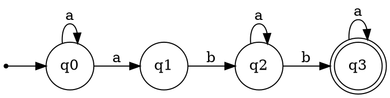

# Finite Automata Conversion and Classification (Variant 18)

### Course: Formal Languages & Finite Automata
### Author: Oberst Eduard

----

## Theory
A finite automaton is defined as:
\[
A = (Q, \Sigma, \delta, q_0, F)
\]
where:
- \(Q\): finite set of states;
- \(\Sigma\): finite alphabet;
- \(\delta\): transition mapping;
- \(q_0 \in Q\): start state;
- \(F \subseteq Q\): set of accepting states.

In a **DFA**, each pair \((q, a)\) has exactly one next state (or one in partial DFA form).  
In an **NFA**, a pair \((q, a)\) may have zero, one, or multiple next states.

For this laboratory, the conversion chain is:
1. Build NFA (Variant 18).
2. Detect determinism.
3. Convert NFA to DFA by subset construction.
4. Convert FA to right-linear grammar.
5. Classify grammar by Chomsky hierarchy.

Right-linear grammar rules used in the conversion:
- \(A \rightarrow aB\)
- \(A \rightarrow a\)
- \(A \rightarrow \varepsilon\)

If all productions match right-linear form, the grammar is Type-3 (Regular).

Variant 18 automaton:
- \(Q=\{q0,q1,q2,q3\}\)
- \(\Sigma=\{a,b,c\}\)
- \(q_0=q0\)
- \(F=\{q3\}\)
- \(\delta(q0,a)=\{q0,q1\}\)
- \(\delta(q1,b)=\{q2\}\)
- \(\delta(q2,a)=\{q2\}\)
- \(\delta(q2,b)=\{q3\}\)
- \(\delta(q3,a)=\{q3\}\)

Key theoretical observation: the automaton is non-deterministic because \(\delta(q0,a)\) has two targets.

## Objectives:

* Implement reusable Python classes for finite automata and grammars.
* Define Variant 18 NFA exactly as given in the assignment.
* Check if the given automaton is deterministic.
* Build equivalent DFA using subset construction.
* Convert the automaton to regular grammar using state-to-nonterminal mapping.
* Determine the Chomsky type of the resulting grammar.
* Export automata as Graphviz DOT text for visualization.
* Document assumptions and design choices (notably dead-state omission).

## Implementation description

* `FiniteAutomaton` uses `dict[(state, symbol)] -> set[next_state]`, which is suitable for NFA and still valid for DFA (singleton sets).
* Constructor validation checks state membership, alphabet correctness, and transition consistency to prevent invalid structures at creation time.
* `is_deterministic()` returns `False` when at least one transition key has more than one target (as in `delta(q0, a)`).
* `to_dfa()` performs subset construction with internal `frozenset[str]` states and maps them to readable labels like `{q0,q1}`.
* By assignment choice, empty-set transitions are omitted, so the resulting DFA is partial and does not include an explicit dead state.
* `to_regular_grammar()` builds productions with rule `qi --a--> qj` -> `qi -> a qj` and adds epsilon production for each final state.
* `Grammar.classify_chomsky()` checks classes from most restrictive to least restrictive and classifies this grammar as Type-3.
* `to_dot()` generates Graphviz text with start arrow (`__start__ -> start_state`), double-circle final states, and one edge per target (preserving NFA branching).
* Time complexity note: determinism check is linear in transition entries, while subset construction is exponential in the worst case (\(2^{|Q|}\) DFA states).
* Validation approach: output from `main.py` is cross-checked against expected outcomes (`Deterministic: False`, `Type-3`, and reachable subset states).

* Code snippets from your files.

```python
# 2_FiniteAutomata/finite_automaton.py
def is_deterministic(self) -> bool:
    epsilon_symbols = {"", "eps", "epsilon"}
    for (_, symbol), to_states in self.transitions.items():
        if symbol in epsilon_symbols:
            return False
        if len(to_states) > 1:
            return False
    return True
```

```python
# 2_FiniteAutomata/finite_automaton.py
def to_dfa(self) -> "FiniteAutomaton":
    start_subset = frozenset({self.start_state})
    discovered = {start_subset}
    queue = [start_subset]
    subset_transitions = {}

    while queue:
        current_subset = queue.pop(0)
        for symbol in sorted(self.alphabet):
            next_states = set()
            for state in current_subset:
                next_states.update(self.transitions.get((state, symbol), set()))
            if not next_states:
                continue  # omit dead-state transitions
            next_subset = frozenset(next_states)
            subset_transitions[(current_subset, symbol)] = next_subset
            if next_subset not in discovered:
                discovered.add(next_subset)
                queue.append(next_subset)
```

```python
# 2_FiniteAutomata/main.py
nfa = build_variant_18_nfa()
print(f"Deterministic: {nfa.is_deterministic()}")

grammar = nfa.to_regular_grammar()
print("Chomsky type:", grammar.classify_chomsky())

dfa = nfa.to_dfa()
print("DFA states:", sorted(dfa.states))
print(nfa.to_dot())
print(dfa.to_dot())
```

* If needed, screenshots.

NFA DOT snippet (generated by the program):



## Conclusions / Screenshots / Results

Execution command:

```bash
python 2_FiniteAutomata/main.py
```

Observed console results:

* `Deterministic: False`
* Grammar productions: `q0 -> a q0 | a q1`, `q1 -> b q2`, `q2 -> a q2 | b q3`, `q3 -> epsilon | a q3`
* `Chomsky type: Type-3`
* DFA states: `{q0}`, `{q0,q1}`, `{q2}`, `{q3}`

DFA transition summary:

| State     | on `a`    | on `b` | on `c` |
|-----------|-----------|--------|--------|
| `{q0}`    | `{q0,q1}` | -      | -      |
| `{q0,q1}` | `{q0,q1}` | `{q2}` | -      |
| `{q2}`    | `{q2}`    | `{q3}` | -      |
| `{q3}`    | `{q3}`    | -      | -      |

`-` means transition to empty set, omitted by design.

Language behavior note:

* To reach final state `q3`, the automaton must pass through `q1` and `q2`; accepted words therefore follow the pattern: at least one `a`, then `b`, then zero or more `a`, then `b`, then zero or more `a`.
* Symbol `c` is declared in the alphabet but never contributes to a transition or production.

Personal experience:

* What went well: The class design mirrored formal definitions and made later conversions easier.
* What went bad: The most error-prone part was tracking subset-state naming and keeping report notation consistent with code output.
* What did not work initially: Early Chomsky classification handling for epsilon productions was stricter than assignment expectations.
* How it was fixed: Classification checks were adjusted to the requested interpretation and validated against expected output.
* Main takeaway: Linking formal proofs to runnable outputs (DFA table + DOT) improves both confidence and report quality.

## References

* Course notes, laboratory instructions, and seminar discussions.
* John E. Hopcroft, Rajeev Motwani, Jeffrey D. Ullman, *Introduction to Automata Theory, Languages, and Computation*.
* Michael Sipser, *Introduction to the Theory of Computation*.
* Graphviz DOT Language Reference: https://graphviz.org/doc/info/lang.html
