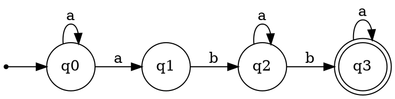

# Formal Languages and Finite Automata
## Laboratory Report

### Variant
18

### 1. Objective
The objective of this laboratory work is to model a finite automaton, analyze its determinism, convert it to an equivalent deterministic automaton, derive the corresponding regular grammar, and classify the grammar in the Chomsky hierarchy.

### 2. Automaton Definition and Determinism
A finite automaton is a 5-tuple:
\[
A = (Q, \Sigma, \delta, q_0, F)
\]
where:
- \(Q\) is a finite set of states,
- \(\Sigma\) is the input alphabet,
- \(\delta\) is the transition function,
- \(q_0\in Q\) is the start state,
- \(F\subseteq Q\) is the set of final states.

An automaton is deterministic if, for every pair \((q, a)\in Q\times\Sigma\), there is at most one next state. If at least one pair has multiple next states, the automaton is non-deterministic.

### 3. Variant 18 NFA
The implemented automaton is:
- \(Q=\{q0, q1, q2, q3\}\)
- \(\Sigma=\{a, b, c\}\)
- \(q_0=q0\)
- \(F=\{q3\}\)

Transitions:
- \(\delta(q0, a)=\{q0, q1\}\)
- \(\delta(q1, b)=\{q2\}\)
- \(\delta(q2, a)=\{q2\}\)
- \(\delta(q2, b)=\{q3\}\)
- \(\delta(q3, a)=\{q3\}\)

The symbol \(c\) belongs to the alphabet but has no outgoing transitions from any state.

### 4. Why Variant 18 Is Non-Deterministic
Variant 18 is non-deterministic because:
\[
\delta(q0, a)=\{q0, q1\}
\]
For the same input symbol \(a\), state \(q0\) has two possible next states. Therefore, the determinism condition is violated.

### 5. NFA to DFA Conversion (Subset Construction)
The conversion uses subsets of NFA states as DFA states. The dead state (empty set) is intentionally omitted.

Step-by-step:
1. Start DFA state: \(\{q0\}\).
2. From \(\{q0\}\) on \(a\): \(\{q0, q1\}\).
3. From \(\{q0, q1\}\) on \(a\): \(\{q0, q1\}\), on \(b\): \(\{q2\}\).
4. From \(\{q2\}\) on \(a\): \(\{q2\}\), on \(b\): \(\{q3\}\).
5. From \(\{q3\}\) on \(a\): \(\{q3\}\).
6. Missing transitions (including all transitions on \(c\)) are not materialized as edges to a dead state.

Reachable DFA states:
- \(\{q0\}\)
- \(\{q0,q1\}\)
- \(\{q2\}\)
- \(\{q3\}\)

Final DFA states are those containing \(q3\), therefore:
- \(\{q3\}\)

### 6. DFA State Table (Reachable States)
| DFA State | on `a`      | on `b`   | on `c` |
|-----------|-------------|----------|--------|
| `{q0}`    | `{q0,q1}`   | -        | -      |
| `{q0,q1}` | `{q0,q1}`   | `{q2}`   | -      |
| `{q2}`    | `{q2}`      | `{q3}`   | -      |
| `{q3}`    | `{q3}`      | -        | -      |

`-` indicates omitted empty-set transitions due to the adopted design choice (no dead state).

### 7. FA to Regular Grammar Conversion Rules
Conversion rules used:
1. Each automaton state \(q_i\) becomes a grammar nonterminal \(Q_i\).  
   In implementation, the same names are reused (`q0`, `q1`, `q2`, `q3`).
2. For each transition \(q_i \xrightarrow{a} q_j\), add production:
   \[
   q_i \to a q_j
   \]
3. For each final state \(q_f\), add:
   \[
   q_f \to \varepsilon
   \]
4. Start symbol is the automaton start state (`q0`).

Generated productions:
- `q0 -> a q0 | a q1`
- `q1 -> b q2`
- `q2 -> a q2 | b q3`
- `q3 -> epsilon | a q3`

### 8. Chomsky Hierarchy Classification
The generated grammar is classified as **Type-3 (Regular)**.

Justification:
1. Every production has one nonterminal on the left-hand side.
2. Right-hand sides are only in right-linear forms:
   - \(A \to aB\),
   - \(A \to a\),
   - \(A \to \varepsilon\).
3. No left-linear forms (such as \(A \to Ba\)) are present.

Since the grammar satisfies right-linear constraints, it is Type-3. By hierarchy inclusion, it is also Type-2 and Type-1, but the most specific class is Type-3.

### 9. Treatment of Symbol `c`
The symbol `c` is part of both the automaton alphabet and grammar terminals, but it has no behavior-producing rules:
- No NFA transitions are labeled with `c`.
- No reachable DFA transition exists on `c` (dead state omitted by design).
- No grammar production starts with terminal `c`.

Thus, `c` is syntactically declared but semantically inactive in this variant.

### 10. DOT Visualization Snippet
The implementation exports Graphviz DOT for both NFA and DFA.  
NFA snippet:



### 11. Reproducibility
From project root, run:

```bash
python 2_FiniteAutomata/main.py
```

or, after changing into the module directory:

```bash
cd 2_FiniteAutomata
python main.py
```

The script prints:
- determinism result,
- grammar productions,
- Chomsky type,
- DFA states/transitions,
- DOT outputs for NFA and DFA.

### 12. Implementation Notes
The implementation is object-oriented and centered around two core classes:
- `FiniteAutomaton`: stores states, alphabet, transitions, start state, and final states.
- `Grammar`: stores nonterminals, terminals, productions, and start symbol.

Important design choices:
1. **Transition representation**: transitions are stored as  
   `dict[(state, symbol)] -> set(next_states)` to naturally support NFA branching.
2. **DFA conversion representation**: subset states are internally represented as `frozenset[str]`, then converted to readable names such as `{q0,q1}`.
3. **No dead state policy**: empty-set transitions are omitted in the DFA output to keep the constructed automaton minimal and readable for this laboratory requirement.
4. **DOT export as text only**: visualization is generated as Graphviz DOT code without using external automata-processing libraries.

### 13. Correctness and Validation Strategy
To validate correctness, the following checks were applied:
1. **Structural validation** in constructors:
   - start state is in state set,
   - final states are subset of states,
   - transition symbols belong to alphabet,
   - transition targets belong to states.
2. **Determinism check**:
   - if any pair `(state, symbol)` has more than one target, automaton is non-deterministic.
3. **NFA to DFA consistency**:
   - each DFA transition equals the union of NFA transitions over all states in the subset.
4. **Grammar conversion consistency**:
   - each FA transition maps to `A -> aB`,
   - each final state maps to epsilon production.
5. **Chomsky classification consistency**:
   - resulting grammar is verified to satisfy right-linear constraints.

### 14. Complexity Discussion
Let:
- `n = |Q|` (number of NFA states),
- `m = |\Sigma|` (alphabet size).

Then:
1. **Determinism test** runs in \(O(|\delta|)\), where \(|\delta|\) is number of transition entries.
2. **Subset construction** has worst-case number of DFA states \(2^n\), so worst-case time is exponential in `n`.
3. **FA to grammar conversion** is linear in number of transitions plus number of final states.

For Variant 18, the state space is small, so all operations complete quickly and are easy to inspect manually.

### 15. Limitations and Possible Extensions
Current scope limitations:
1. No explicit epsilon-closure algorithm is needed because Variant 18 does not use epsilon transitions.
2. DFA minimization is not included.
3. Dead state is intentionally omitted; therefore, DFA is partial with respect to alphabet symbols.

Possible future extensions:
1. Add optional dead-state completion mode.
2. Add DFA minimization (partition refinement).
3. Add acceptance testing for input strings and trace visualization.
4. Add automatic DOT file export to disk (currently text is printed only).

### 16. Personal Experience and Reflection
This laboratory task was valuable for connecting formal definitions with executable models.

What went well:
1. Translating mathematical definitions into class-based code was straightforward.
2. The subset-construction algorithm became clear once states were represented as sets.
3. DOT export significantly improved interpretability of transitions and final states.

What went badly / challenges:
1. The most error-prone part was ensuring consistent naming of DFA subset states.
2. Handling omitted transitions (due to no dead-state policy) required careful explanation in both code comments and report tables.
3. Grammar classification rules were initially too strict around epsilon handling and had to be aligned with the task specification.

What did not work at first:
1. Early classification logic rejected some epsilon productions in a way that conflicted with the requested Type-3 form.
2. Initial output formatting was technically correct but not sufficiently readable for report-level presentation.

How issues were resolved:
1. Classification checks were revised to match the precise assignment rules.
2. Additional formatted output sections were introduced for transitions, productions, and DOT snippets.
3. Assertions and runnable demo output were used to confirm expected results (`Deterministic: False`, `Chomsky type: Type-3`).

Lessons learned:
1. Formal-language tasks benefit from explicit invariants and validation at object construction time.
2. A clear conversion trace (NFA -> DFA -> Grammar) is essential for both correctness and report quality.
3. Tooling for visualization (even plain DOT text) helps detect modeling mistakes earlier.
